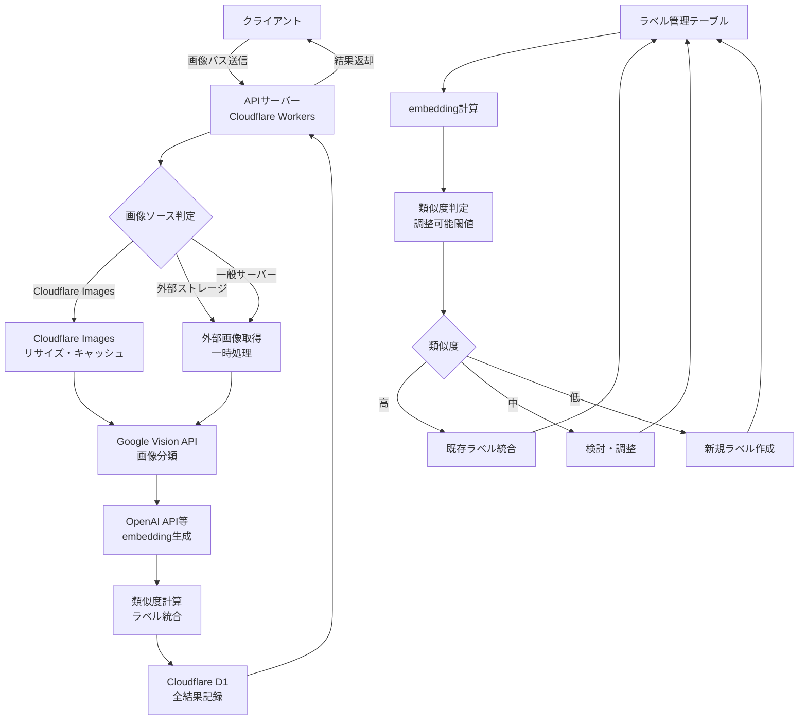

# 画像分類API連携・DB保存処理 仕様書

本ドキュメントは、画像ファイルのパスを入力としてAI画像分類APIにリクエストし、その結果をデータベースに保存するシステムの設計・仕様をまとめたものです。

## 目次

1. [システム概要](#1-システム概要)
2. [システム構成図](#2-システム構成図)
3. [全体フロー](#3-全体フロー)
4. [設計方針](#4-設計方針)
5. [画像カテゴリ分類ロジック](#5-画像カテゴリ分類ロジック)
6. [API仕様](#6-api仕様)
7. [データベース仕様](#7-データベース仕様)
8. [画像データの取り扱い](#8-画像データの取り扱い)
9. [開発環境](#9-開発環境)

---

## 1. システム概要

本システムは、Cloudflare Workers上でAPIサーバー・DBを構築し、画像分類結果をデータベースに保存するシステムです。API仕様はOpenAPI形式でSwagger UIから参照可能です。

### 主な機能
- 多様な画像ソース（Cloudflare Images、外部ストレージ、一般サーバー）に対応
- Google Vision APIによる高精度な画像分類
- 成功・失敗を問わず全リクエストのDB記録
- 柔軟なラベル統合システム（閾値調整可能）
- OpenAPI仕様によるSwagger UI公開

---

## 2. システム構成図



## 3. 全体フロー

1. **画像パス受信**: クライアントから画像ファイルパスを受信
2. **画像ソース判定**: Cloudflare Images、外部ストレージ、一般サーバーを判定
3. **画像処理**: ソースに応じた最適な処理（リサイズ・キャッシュ等）
4. **AI分析**: Google Vision APIで画像分類実行
5. **embedding生成**: OpenAI API等でembeddingベクトル生成
6. **ラベル統合**: 調整可能な閾値による類似度判定・統合
7. **全結果記録**: 成功・失敗を問わずD1データベースに保存
8. **結果返却**: クライアントに分析結果を返却

---

## 4. 設計方針

### 技術スタック
- **APIサーバー**: Cloudflare Workers（hono + openapi）
- **データベース**: Cloudflare Workers D1
- **画像処理**: Cloudflare Images（リサイズ・キャッシュ機能）
- **画像分類API**: Google Vision API
- **embedding生成**: OpenAI API等の外部サービス
- **API仕様管理**: Cloudflare Workers側でOpenAPI仕様・スキーマ管理

### 柔軟性・運用方針
- **画像ソース**: Cloudflare Images以外の外部ストレージ・一般サーバーも対応
- **類似度閾値**: 運用に応じて調整可能な柔軟設計
- **全記録方針**: 成功・失敗を問わず全リクエストをDB記録
- **スキーマ管理**: マイグレーション等の運用ルールは現時点では設けない
- **画像フォーマット**: JPEG, PNG対応
- **画像モック**: Lorem Picsum利用

---

## 5. 画像カテゴリ分類ロジック

AIによるembeddingを用いた類似度計算により、自動的にクラス分け・ラベル統合・粒度統一を行います。

### 5.1 クラス自動振り分けフロー

1. **embedding計算**: 画像ラベルと既存カテゴリのembeddingベクトルを比較
2. **類似度判定**: cosine類似度による分類
3. **クラス決定**: 類似度に基づく統合・新規作成判定
4. **管理**: idとクラス名の対応管理

### 5.2 類似度判定基準（調整可能）

| 類似度範囲 | 処理内容 | 備考 |
|-----------|----------|------|
| > 0.8 | 既存ラベルに統合 | 閾値は運用に応じて調整可能 |
| 0.5 〜 0.8 | 検討（統合 or 新規） | 中間範囲の処理ロジックも柔軟に対応 |
| < 0.5 | 新規ラベル作成 | 低類似度での新規作成基準も調整可能 |

**注意**: 上記の閾値（0.8, 0.5）は初期設定値であり、運用状況に応じて柔軟に調整可能です。

### 5.3 ラベル管理テーブル

| カラム名 | データ型 | 制約 | 説明 |
|---------|---------|------|------|
| id | INTEGER | PRIMARY KEY AUTOINCREMENT | 主キー |
| label | TEXT | NOT NULL | ラベル名 |
| embedding | TEXT | NOT NULL | AI embedding ベクトル（JSON形式） |
| class_id | INTEGER | NOT NULL | クラスID |
| created_at | DATETIME | DEFAULT CURRENT_TIMESTAMP | 作成日時 |
| updated_at | DATETIME | DEFAULT CURRENT_TIMESTAMP | 更新日時 |

#### CREATE TABLE文

```sql
CREATE TABLE label_management (
    id INTEGER PRIMARY KEY AUTOINCREMENT,
    label TEXT NOT NULL,
    embedding TEXT NOT NULL,
    class_id INTEGER NOT NULL,
    created_at DATETIME DEFAULT CURRENT_TIMESTAMP,
    updated_at DATETIME DEFAULT CURRENT_TIMESTAMP
);
```

---

## 6. API仕様

### エンドポイント

**POST** `/classify`

### リクエスト

```json
{
    "image_path": "/image/d03f1d36ca69348c51aa/c413eac329e1c0d03/test.jpg"
}
```

### レスポンス

#### 成功時
```json
{
    "success": true,
    "message": "success",
    "estimated_data": {
        "class": 3,
        "confidence": 0.8683
    }
}
```

#### 失敗時
```json
{
    "success": false,
    "message": "Error:E50012",
    "estimated_data": {}
}
```

---

## 7. データベース仕様

### テーブル: `ai_analysis_log`

| カラム名 | データ型 | 制約 | 説明 |
|---------|---------|------|------|
| id | INTEGER | PRIMARY KEY AUTOINCREMENT | 主キー |
| image_path | TEXT | - | 画像ファイルパス |
| success | INTEGER | NOT NULL | 成功フラグ（0: 失敗, 1: 成功） |
| message | TEXT | - | メッセージ |
| class | INTEGER | - | 分類クラス |
| confidence | REAL | - | 信頼度 |
| request_timestamp | DATETIME | - | リクエスト時刻 |
| response_timestamp | DATETIME | - | レスポンス時刻 |

#### CREATE TABLE文

```sql
CREATE TABLE ai_analysis_log (
    id INTEGER PRIMARY KEY AUTOINCREMENT,
    image_path TEXT,
    success INTEGER NOT NULL,
    message TEXT,
    class INTEGER,
    confidence REAL,
    request_timestamp DATETIME,
    response_timestamp DATETIME
);
```

---

## 8. 画像データの取り扱い

### 画像ソース対応
1. **Cloudflare Images**: 最適化されたリサイズ・キャッシュ処理
2. **外部ストレージ**: S3、GCS等の外部ストレージからの画像取得
3. **一般サーバー**: HTTP/HTTPS経由での画像取得

### 画像処理フロー
1. **画像パス受信**: 多様なソースの画像パスを受信
2. **ソース判定**: URLパターンによる画像ソース自動判定
3. **最適化処理**: 
   - Cloudflare Images: リサイズ・キャッシュ機能活用
   - 外部ソース: 一時取得・最適化処理
4. **Google Vision API連携**: 処理済み画像で分類実行

### 特徴・柔軟性
- **多様なソース対応**: Cloudflare Images以外も柔軟に対応
- **自動最適化**: Workersで処理できる最適なサイズに自動調整
- **キャッシュ機能**: 同一画像の再処理を高速化
- **フォーマット対応**: JPEG, PNG
- **画像モック**: [Lorem Picsum](https://picsum.photos/) 利用

---

## 9. 開発環境

### 開発ツール
- **パッケージマネージャー**: pnpm
- **コミットメッセージ規約**: Conventional Commits
- **コミットリント**: commitlint + husky
- **プリコミットフック**: husky

### セットアップ
```bash
# 依存関係のインストール
pnpm install

# huskyの初期化
pnpm prepare
```

### コミットメッセージ規約
本プロジェクトでは[Conventional Commits](https://www.conventionalcommits.org/)に準拠したコミットメッセージを使用しています。

#### フォーマット
```
type(scope): subject

body

footer
```

#### 主なtype
- `feat`: 新機能
- `fix`: バグ修正
- `docs`: ドキュメント更新
- `style`: コードスタイル修正
- `refactor`: リファクタリング
- `test`: テスト追加・修正
- `chore`: その他の変更

### Git Hooks
- **pre-commit**: テスト実行
- **commit-msg**: コミットメッセージの形式チェック
