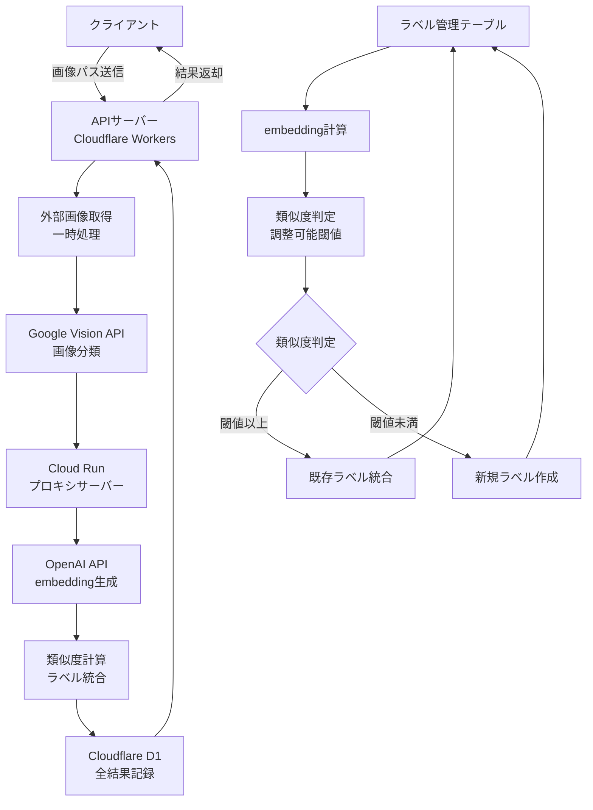

# 画像分類API連携・DB保存処理 仕様書

本ドキュメントは、画像ファイルのパスを入力としてAI画像分類APIにリクエストし、その結果をデータベースに保存するシステムの設計・仕様をまとめたものです。

## 目次

1. [システム概要](#1-システム概要)
2. [システム構成図](#2-システム構成図)
3. [全体フロー](#3-全体フロー)
4. [設計方針](#4-設計方針)
5. [画像カテゴリ分類ロジック](#5-画像カテゴリ分類ロジック)
6. [API仕様](#6-api仕様)
7. [データベース仕様](#7-データベース仕様)
8. [画像データの取り扱い](#8-画像データの取り扱い)
9. [開発環境](#9-開発環境)

---

## 1. システム概要

本システムは、Cloudflare Workers上でAPIサーバー・DBを構築し、画像分類結果をデータベースに保存するシステムです。OpenAI APIへのアクセスはCloud Runで構築したプロキシサーバーを経由します。API仕様はOpenAPI形式でSwagger UIから参照可能です。

### 主な機能
- 多様な画像ソース（外部ストレージ、一般サーバー）に対応
- Google Vision APIによる高精度な画像分類
- Cloud RunプロキシサーバーによるOpenAI API連携
- 成功・失敗を問わず全リクエストのDB記録
- 柔軟なラベル統合システム（閾値調整可能）
- OpenAPI仕様によるSwagger UI公開

---

## 2. システム構成図



## 3. 全体フロー

1. **画像パス受信**: クライアントから画像ファイルパスを受信
2. **画像取得**: 外部ストレージ・一般サーバーから画像を取得・一時処理
3. **AI分析**: Google Vision APIで画像分類実行
4. **embedding生成**: Cloud Runプロキシサーバー経由でOpenAI APIからembeddingベクトル生成
5. **ラベル統合**: 調整可能な閾値による類似度判定・統合
6. **全結果記録**: 成功・失敗を問わずD1データベースに保存
7. **結果返却**: クライアントに分析結果を返却

---

## 4. 設計方針

### 技術スタック
- **APIサーバー**: Cloudflare Workers（hono + openapi）
- **データベース**: Cloudflare Workers D1
- **プロキシサーバー**: Cloud Run（OpenAI API連携用）
- **画像分類API**: Google Vision API
- **embedding生成**: OpenAI API（Cloud Run経由）
- **API仕様管理**: Cloudflare Workers側でOpenAPI仕様・スキーマ管理

### 柔軟性・運用方針
- **画像ソース**: 外部ストレージ・一般サーバーから直接画像パスを取得
- **類似度閾値**: 運用に応じて調整可能な柔軟設計
- **全記録方針**: 成功・失敗を問わず全リクエストをDB記録
- **スキーマ管理**: マイグレーション等の運用ルールは現時点では設けない
- **画像フォーマット**: JPEG, PNG対応
- **画像モック**: Lorem Picsum利用

---

## 5. 画像カテゴリ分類ロジック

AIによるembeddingを用いた類似度計算により、自動的にクラス分け・ラベル統合・粒度統一を行います。

### 5.1 クラス自動振り分けフロー

1. **embedding計算**: 画像ラベルと既存カテゴリのembeddingベクトルを比較
2. **類似度判定**: cosine類似度による分類
3. **クラス決定**: 類似度に基づく統合・新規作成判定
4. **管理**: idとクラス名の対応管理

### 5.2 類似度判定基準（調整可能）

| 類似度範囲 | 処理内容 | 備考 |
|-----------|----------|------|
| ≥ 閾値 | 既存ラベルに統合 | 閾値は運用に応じて調整可能 |
| < 閾値 | 新規ラベル作成 | 低類似度での新規作成 |

**注意**: 閾値は初期設定値であり、運用状況に応じて柔軟に調整可能です。

### 5.3 ラベル管理テーブル

| カラム名 | データ型 | 制約 | 説明 |
|---------|---------|------|------|
| id | INTEGER | PRIMARY KEY AUTOINCREMENT | 主キー |
| label | TEXT | NOT NULL | ラベル名 |
| embeddings | TEXT | NOT NULL | AI embedding ベクトル（コンマ区切り形式） |

#### CREATE TABLE文

```sql
CREATE TABLE label_management (
    id INTEGER PRIMARY KEY AUTOINCREMENT,
    label TEXT NOT NULL,
    embeddings TEXT NOT NULL
);
```

---

## 6. API仕様

### エンドポイント

image-classification-apiのエンドポイントは
https://image-classification-api.sho-lab.workers.dev
です。

**POST** `/classification`

### リクエスト

```json
{
    "image_path": "/image/d03f1d36ca69348c51aa/c413eac329e1c0d03/test.jpg"
}
```

### レスポンス

#### 成功時
```json
{
    "success": true,
    "message": "success",
    "estimated_data": {
        "class": 3,
        "confidence": 0.8683
    }
}
```

#### 失敗時
```json
{
    "success": false,
    "message": "Error:E50012",
    "estimated_data": {}
}
```

---

## 7. データベース仕様

### テーブル: `ai_analysis_log`

| カラム名 | データ型 | 制約 | 説明 |
|---------|---------|------|------|
| id | INTEGER | PRIMARY KEY AUTOINCREMENT | 主キー |
| image_path | TEXT | - | 画像ファイルパス |
| success | INTEGER | NOT NULL | 成功フラグ（0: 失敗, 1: 成功） |
| message | TEXT | - | メッセージ |
| class | INTEGER | - | 分類クラス |
| confidence | REAL | - | 信頼度 |
| request_timestamp | TEXT | - | リクエスト時刻（ISO文字列） |
| response_timestamp | TEXT | - | レスポンス時刻（ISO文字列） |

#### CREATE TABLE文

```sql
CREATE TABLE ai_analysis_log (
    id INTEGER PRIMARY KEY AUTOINCREMENT,
    image_path TEXT,
    success INTEGER NOT NULL,
    message TEXT,
    class INTEGER,
    confidence REAL,
    request_timestamp TEXT,
    response_timestamp TEXT
);
```

---

## 8. 画像データの取り扱い

### 画像ソース対応
1. **外部ストレージ**: S3、GCS等の外部ストレージからの画像取得
2. **一般サーバー**: HTTP/HTTPS経由での画像取得

### 画像処理フロー
1. **画像パス受信**: 外部ソースの画像パスを受信
2. **画像取得**: 指定されたパスから画像を取得・一時処理
3. **Google Vision API連携**: 取得した画像で分類実行

### 特徴・柔軟性
- **直接パス指定**: 外部ストレージ・一般サーバーから直接画像パスを指定
- **自動最適化**: Workersで処理できる最適なサイズに自動調整
- **フォーマット対応**: JPEG, PNG
- **画像モック**: [Lorem Picsum](https://picsum.photos/) 利用

---

## 9. 開発環境

### プロジェクト構造
本プロジェクトはmonorepo構造を採用しており、複数のアプリケーションを統合管理しています。

```
invox-tech-assignment/
├── apps/
│   ├── image-classification-api/    # 画像分類API（Cloudflare Workers）
│   └── proxy-api-for-open-ai/       # OpenAI APIプロキシ（Cloud Run）
├── docs/                            # ドキュメント
├── pnpm-workspace.yaml             # pnpmワークスペース設定
└── package.json                     # ルートパッケージ設定
```

### 開発ツール
- **パッケージマネージャー**: pnpm（ワークスペース対応）
- **コミットメッセージ規約**: Conventional Commits
- **コミットリント**: commitlint + husky
- **プリコミットフック**: husky
- **コードフォーマッター・リンター**: Biome
- **プリコミット品質チェック**: lint-staged

### セットアップ
```bash
# 依存関係のインストール（全ワークスペース）
pnpm install

# huskyの初期化
pnpm prepare

# 特定のアプリケーションでの作業
cd apps/image-classification-api
pnpm dev

cd apps/proxy-api-for-open-ai
pnpm dev
```

### CI/CD
現在実装済み：
- **Cloud Runデプロイ**: mainブランチプッシュ時の自動デプロイ（proxy-api-for-open-ai）
- **GCP認証**: Workload Identity Federationによる安全な認証

今後構築予定：
- **Worker Build連携**: Cloudflare Workers Buildとの統合
- **環境分離**: 開発・ステージング・本番環境の分離
- **品質チェック**: Biome、テスト、型チェックの自動実行

### コミットメッセージ規約
本プロジェクトでは[Conventional Commits](https://www.conventionalcommits.org/)に準拠したコミットメッセージを使用しています。

#### フォーマット
```
type(scope): subject

body

footer
```

#### 主なtype
- `feat`: 新機能
- `fix`: バグ修正
- `docs`: ドキュメント更新
- `style`: コードスタイル修正
- `refactor`: リファクタリング
- `test`: テスト追加・修正
- `chore`: その他の変更

### Git Hooks
- **pre-commit**: テスト実行、TypeScript型チェック、lint-staged実行
- **commit-msg**: コミットメッセージの形式チェック
